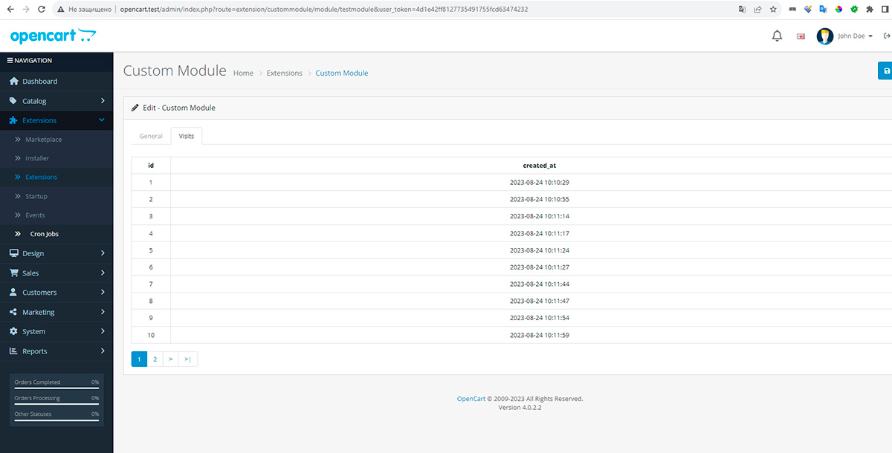
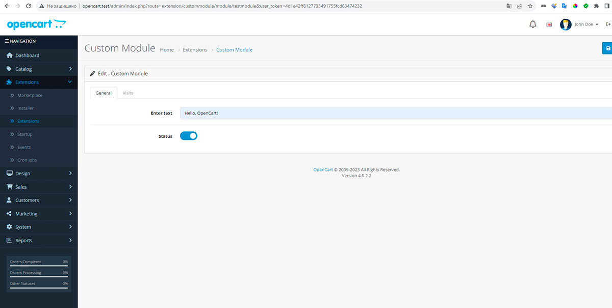
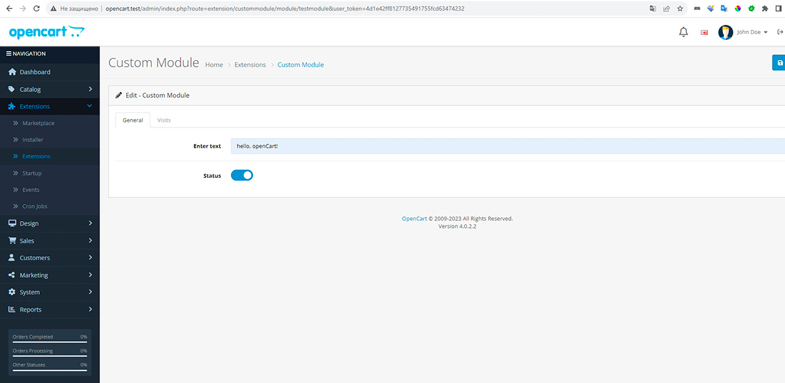

<h1 align="center">OpenCart</h1>

В репозитории 5 веток для каждой задачи

### Задача 0: Установка OpenCart на локальном сервере
```
Установите OpenCart на свой локальный сервер.
Пришлите скриншот рабочего магазина и административной панели.
(Опционально) Если у вас есть опыт работы с Git, создайте репозиторий и
зафиксируйте начальное состояние OpenCart после установки
```


### Задача 1: Создание нового модуля
```
Создайте простой модуль для OpenCart, который будет выводить фразу "Hello,
OpenCart!" на главной странице магазина.
Модуль должен иметь административную часть, где можно включать/выключать
отображение этой фразы.
```


### Задача 2: Работа с базой данных
```
Добавьте в ваш модуль возможность сохранять в базу данных дату и время
последнего посещения главной страницы магазина пользователем.
В административной части модуля создайте страницу, на которой можно
просматривать список дат и времени всех посещений.
```



### Задача 3: Изменение логики работы
```
Измените ваш модуль так, чтобы фраза "Hello, OpenCart!" отображалась только для
авторизованных пользователей.
Добавьте возможность в административной части задавать произвольный текст вместо
"Hello, OpenCart!"
```



### Задача 4: PHP-задача
```angular2html
Напишите функцию на PHP, которая принимает строку и возвращает строку, в которой
каждое слово начинается с большой буквы, а остальные символы слова — маленькие.
```

