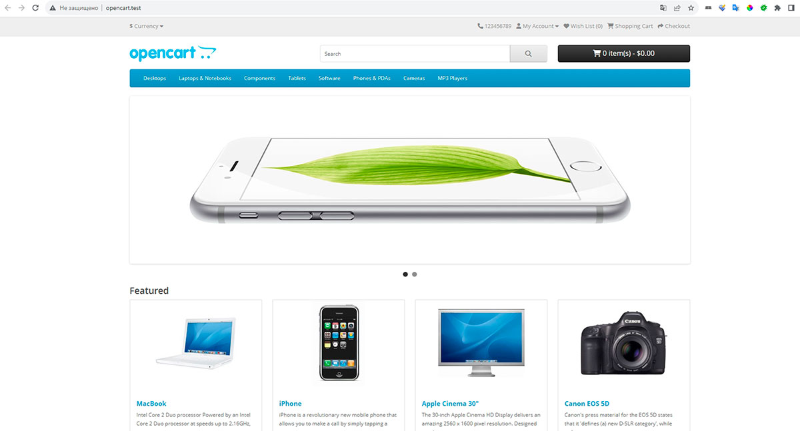
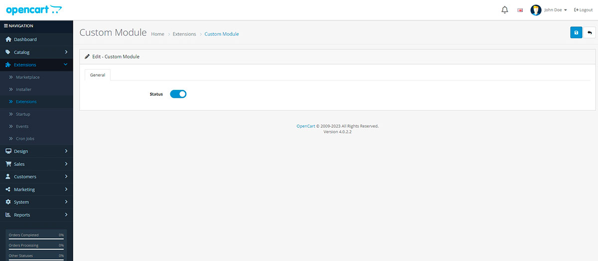
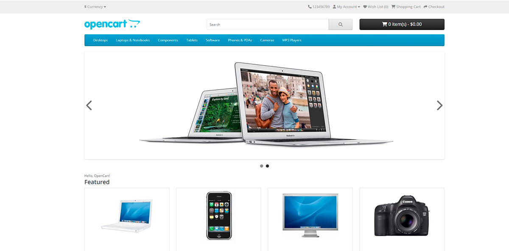

<h1 align="center">OpenCart</h1>

В репозитории 5 веток для каждой задачи

### Задача 0: Установка OpenCart на локальном сервере
```
Установите OpenCart на свой локальный сервер.
Пришлите скриншот рабочего магазина и административной панели.
(Опционально) Если у вас есть опыт работы с Git, создайте репозиторий и
зафиксируйте начальное состояние OpenCart после установки
```




### Задача 1: Создание нового модуля
```
Создайте простой модуль для OpenCart, который будет выводить фразу "Hello,
OpenCart!" на главной странице магазина.
Модуль должен иметь административную часть, где можно включать/выключать
отображение этой фразы.
```

