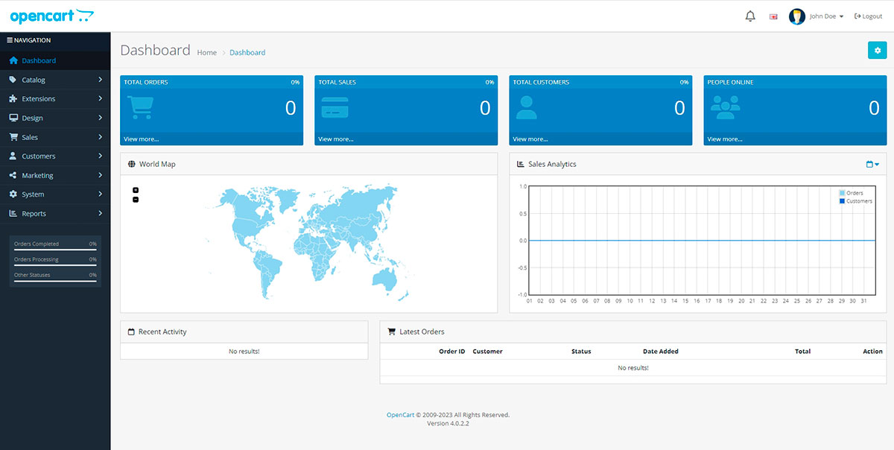

<h1 align="center">OpenCart</h1>

В репозитории 5 веток для каждой задачи

### Задача 0: Установка OpenCart на локальном сервере
```
Установите OpenCart на свой локальный сервер.
Пришлите скриншот рабочего магазина и административной панели.
(Опционально) Если у вас есть опыт работы с Git, создайте репозиторий и
зафиксируйте начальное состояние OpenCart после установки
```


